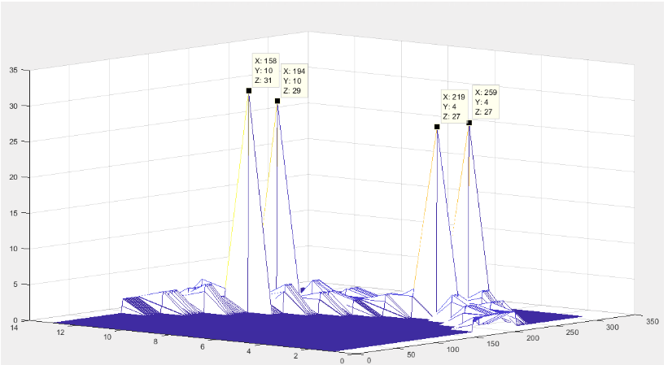

# Shape Detection with Hough Transform

## Overview
This project takes BMP image files of shapes and determines both the shape and its orientation.  
The program was developed in **Code Composer Studio (CCS)** for the **TI L138/C6748 Development Kit (LCDK)**, a single-core DSP platform for low-power, low-cost applications in biometrics, analytics, audio, and communications.

Object detection is widely used in real-world applications such as facial recognition and obstacle detection in self-driving cars. This project explores the fundamentals of that process through shape and edge detection.

---

## Approach
The program applies a **Hough Transform** to analyze the image:

1. Convert the BMP image from the **x–y domain** into the **r–θ domain**.  
2. Detect line segments by locating intersections of points in the transform space.  
3. Use the number of peaks to identify the number of edges.  
4. Determine orientation from the angles (θ values) of the peaks.

---

## Example
**Input:** BMP of a diamond shape  
**Output:**  

- Four peaks in the Hough Transform → four edges detected  
- Peaks at ~45° and ~135° → orientation determined  

  
*(The image shows four peaks corresponding to the diamond’s edges and orientation.)*

---

## Tools & Environment
- **IDE:** Code Composer Studio (CCS)  
- **Hardware:** TI L138/C6748 LCDK  
- **Language:** C  

---

## Key Learnings
- Implementing Hough Transform for shape recognition  
- Using DSP hardware for image processing  
- Fundamentals of object detection applied to embedded systems  
